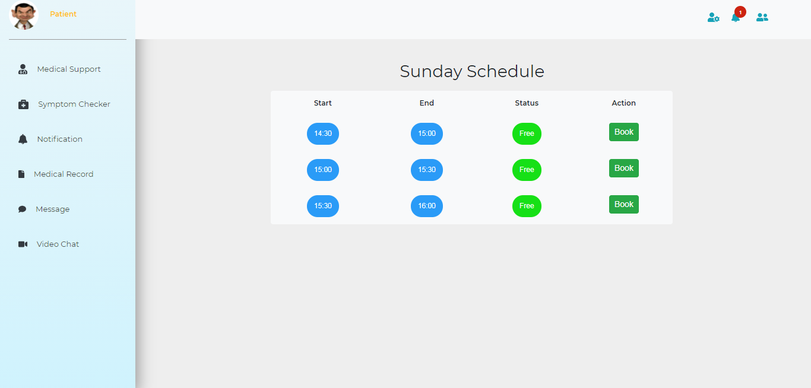
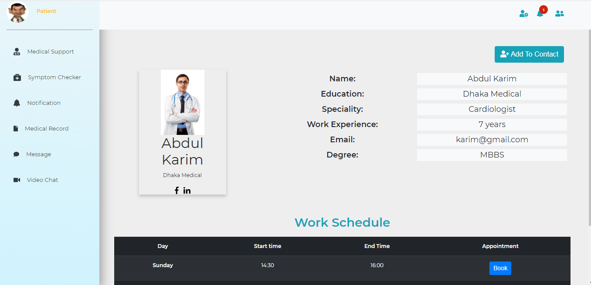
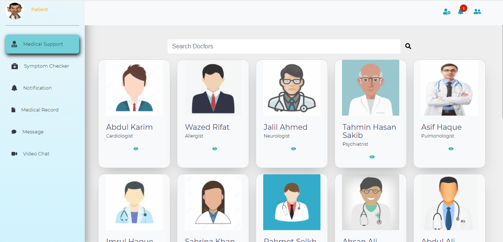
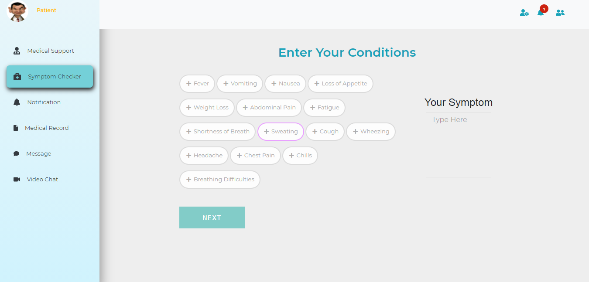
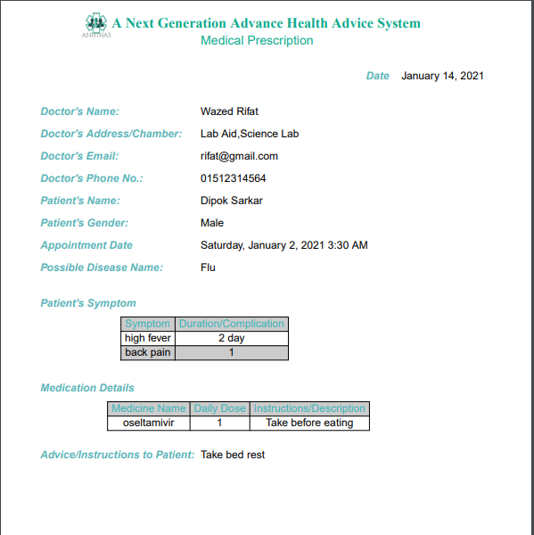
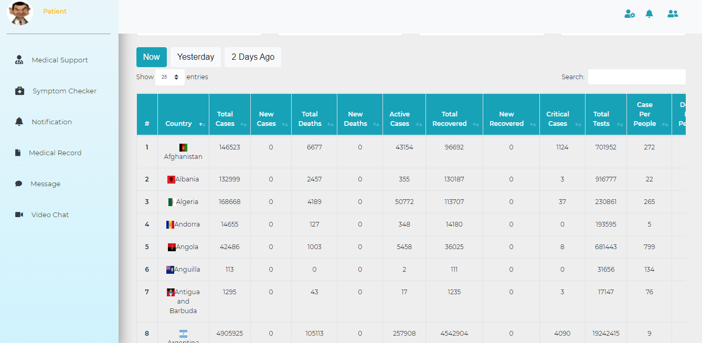
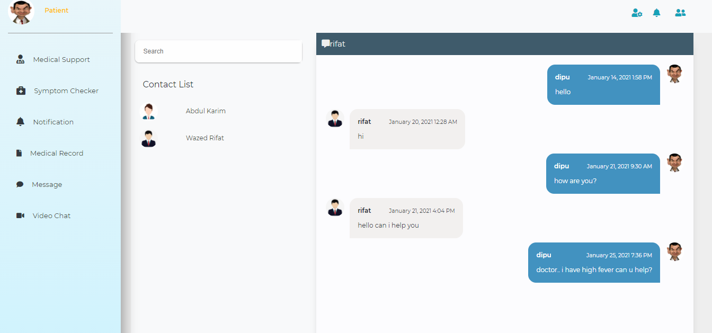

## Online Appointment System

### Features

1. Symptom Checker

2. Request appointment with a particular doctor

3. Video call with doctor

4. Instant messaging between patient and doctor

5. Live corona update

6. E-prescription from doctors

Instruction

> Download Project > Install Nodejs and MongoDB > Enter 'npm install' on terminal> Enter 'npm start' on terminal > Hit 'localhost:5000' in browser

##### Log Into Patient Profile
username : dipu
password : 1234

##### Log Into Doctor Profile
username : rifat
password : 1234

Live Project Link: https://angthas.herokuapp.com/

###### Doctor Schedule

###### Doctor Profile

###### Doctors

###### Symptom Checker

###### Medical Prescription

###### Corona Update

###### Text Messaging

